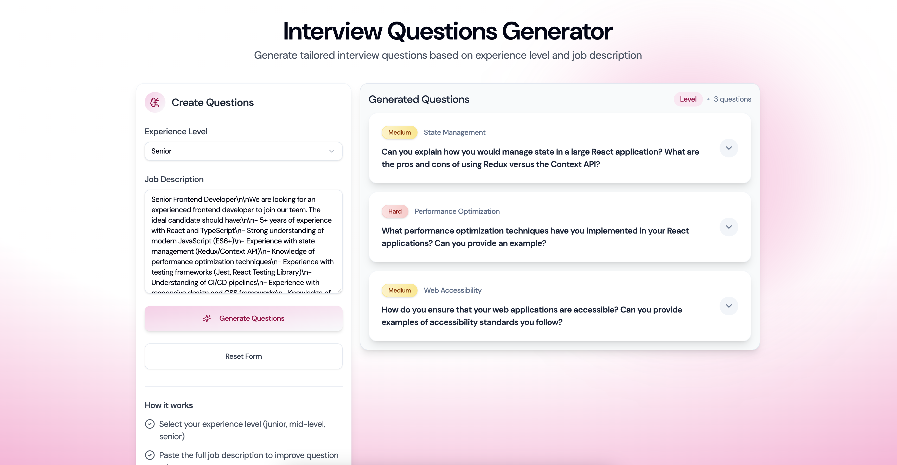
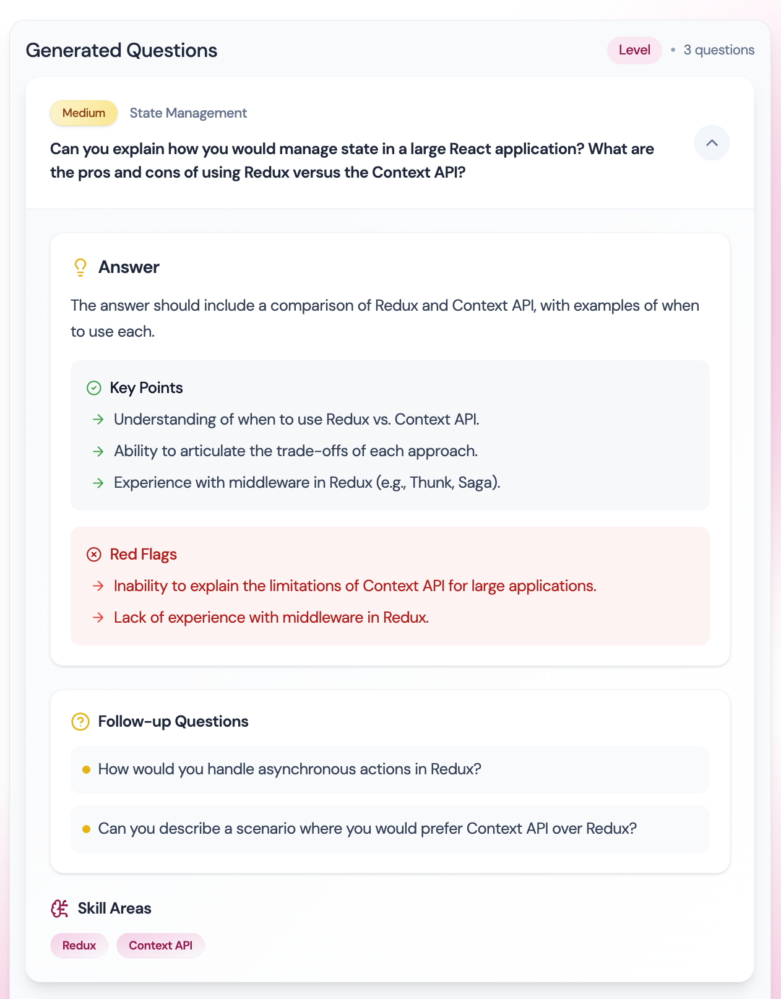

# Recruitely Assignment - Technical Interview Questions Generator

A full-stack application that generates tailored technical interview questions based on job requirements and experience levels.

## 📸 Screenshots

### Home Page



### Question Details



## 🎯 Approach to Question Generation

### Core Strategy

1. **Job Requirements Analysis**

   - Parse job description for key skills
   - Extract technical domains
   - Map to competencies

2. **Question Design Principles**

   - Test required skills
   - Match experience level
   - Include practical scenarios
   - Cover theory and problem-solving
   - Ensure domain relevance

3. **Evaluation Framework**
   - Key points (min 3)
   - Knowledge depth (basic/intermediate/advanced)
   - Red flags (min 2)
   - Follow-up questions (min 2)

## 📊 Question Structure

Each question includes:

1. **Core Components**

   - Question text
   - Difficulty (easy/medium/hard)
   - Category and skills
   - Practical context

2. **Expected Answer**

   - Concept understanding
   - Technical accuracy
   - Real-world application
   - Best practices
   - Edge cases
   - Code examples
   - Decision reasoning
   - Alternative approaches

3. **Metadata**
   - Role
   - Experience level
   - Question count
   - Skills
   - Domain

### Difficulty Factors

- Technical depth required
- Problem complexity
- Expected solution sophistication

## 🚀 Setup Instructions

### Prerequisites

- Node.js (v18+)
- npm/yarn
- OpenAI API key

### Environment Setup

#### Backend (.env)

```
OPENAI_API_KEY=your_key
PORT=8000
```

### Installation Steps

1. **Clone and Install Dependencies**

```bash
# Backend
cd server
npm install

# Frontend
cd client
npm install
```

2. **Start Development Servers**

```bash
# Backend
cd server
npm run dev

# Frontend
cd client
npm run dev
```

The backend will run on http://localhost:8000 and the frontend on http://localhost:5173

### Project Structure

```
├── client/                # Frontend React application
│   ├── src/              # Source files
│   │   ├── components/   # React components
│   │   ├── context/      # State management
│   │   ├── hooks/        # Custom hooks
│   │   ├── schema/       # Validation schemas
│   │   └── types/        # TypeScript types
│   └── package.json      # Frontend dependencies
│
├── server/               # Backend Node.js application
│   ├── src/              # Source files
│   │   ├── routes/       # API routes
│   │   ├── services/     # Business logic
│   │   ├── schemas/      # Validation schemas
│   │   └── types/        # TypeScript types
│   └── package.json      # Backend dependencies
│
└── README.md            # Project documentation
```

## 📝 API Documentation

### Generate Questions

```
POST /api/interview-questions/generate
Body: {
  jobDescription: string;
  experienceLevel: "junior" | "mid-level" | "senior";
}
```

Response:

```typescript
{
  success: boolean;
  questions: Array<{
    question: string;
    difficulty: "easy" | "medium" | "hard";
    category: string;
    skillAreas: string[];
    evaluationCriteria: {
      keyPoints: string[];
      expectedDepth: "basic" | "intermediate" | "advanced";
      redFlags: string[];
    };
    practicalApplication: string;
    expectedAnswer: string;
    followUpQuestions: string[];
  }>;
  metadata: {
    role: string;
    experienceLevel: string;
    totalQuestions: number;
    topics: string[];
    skillAreas: string[];
    domain: "web" | "mobile" | "backend" | "fullstack" | "data" | "devops";
  };
}
```
